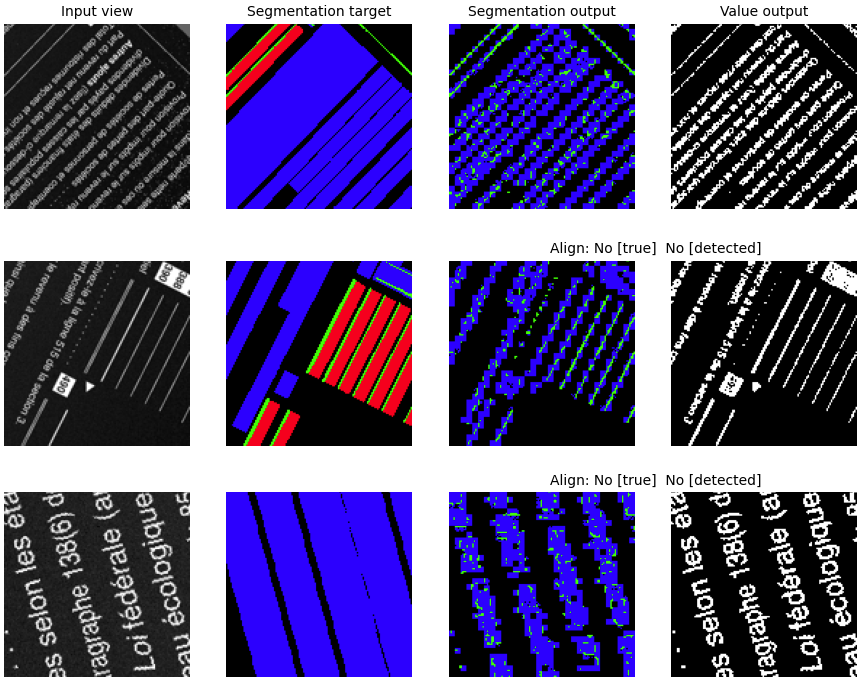
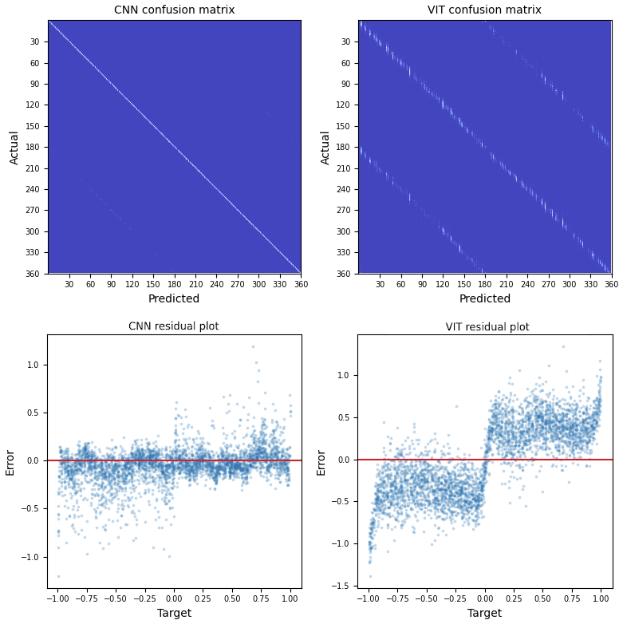

# OCR: ViT vs. CNN
In this experiment we compare `ViT` and `CNN` based `UNet` in document-page layout understanding tasks: different attention module architectures; residual and skip-connections. We used the agent with dynamic visual field (can zoom and rotate): data generated on the go.

### Project `env`
 

        ROOT/             -- notebooks server root
        ├── data/
        │   ├── images/        -- images of pages (single page)
        │   ├── masks/         -- semantic segmentation targets
        │   └── ...
        ├── ...
        ├── models/            -- trained models weights
        ├── scripts/           -- local python utilities
        │   ├── backbone.py
        │   ├── dataset.py
        │   ├── render.py
        │   ├── trainer.py
        │   └── ...
        ├── runs/              -- training logs for `tensorboard`
        └── ...
        

        +-----------------------------------------------------------------------------+
        | NVIDIA-SMI 525.125.06   Driver Version: 525.125.06   CUDA Version: 12.0     |
        |-------------------------------+----------------------+----------------------+
        
        
        numpy==1.25.0
        pandas==2.0.2
        torch==2.0.1+cu118
        torchmetrics==0.11.4
        torchvision==0.15.2+cu118

### Architectures

    === CNN ===================================================================================================

    === ViT ===================================================================================================

We checked two types of attention with `CNN` backbone: in-block and bridge. With `ViT` we only checked `bridge` vs `no-bridge`.

        model:{'residual':False, 'attn':False, 'bridge':False, 'bridge_attn':False }
       
        R:    {'residual':True,  'attn':False, 'bridge':False, 'bridge_attn':False }
        A:    {'residual':False, 'attn':True,  'bridge':False, 'bridge_attn':False } 
        B:    {'residual':False, 'attn':False, 'bridge':True,  'bridge_attn':False }
       
        RA:   {'residual':True,  'attn':True,  'bridge':False, 'bridge_attn':False } 
        RB:   {'residual':True,  'attn':False, 'bridge':True,  'bridge_attn':False }
        AB:   {'residual':False, 'attn':True,  'bridge':True,  'bridge_attn':False } 
        BA:   {'residual':False, 'attn':False, 'bridge':True,  'bridge_attn':True  }
       
        RAB:  {'residual':True,  'attn':True,  'bridge':True,  'bridge_attn':False }
        RBA:  {'residual':True,  'attn':False, 'bridge':True,  'bridge_attn':True  }
        ABA:  {'residual':False, 'attn':False, 'bridge':True,  'bridge_attn':True  }
       
        RABA: {'residual':True,  'attn':True,  'bridge':True,  'bridge_attn':True  }

### Training
We trained all the models side-by-side on the same data batches for comparison in `auto-encoder` and `multitask` modes.

No surprise here: skip-connections (bridges) speed up the training dramatically. The Effect of `residual` and `attention` is more subtle.

For the multitask training we used a single encoder with a set of decoders: segmentation, regression (rotation angle), classification (non-doc, align, orientation).

#### Segmentation
Segmentation task: text presence (blue); table outlines presence (green); potential user input space (red)

    === CNN segmentation ======================================================================================

For the same number of training epochs `CNN` delivers better outcome in "structural" recognition: text, non-doc., and potential input space.

    === ViT segmentation ======================================================================================

Note: `ViT` do better with a `patch-size = 2`, however, not worth of the training time and cost (our system wasn't sufficient to run this configuration).

#### Classification / Regression

After 3 epochs:

After 9 epochs:

#### Latent space

Quite interesting difference in the structure of the latent space produced by `CNN` vs `ViT`:

    === CNN latent space ======================================================================================

    === ViT latent space ======================================================================================

    
### Observations summary
* all models can support non-doc detection as `anomaly` and as a `separate class`
* `residual` and `skip` connections speed up training significantly
* `self-attention` and `bridge-attention` help with denoising
* `self-attention` helps with outliers vs. `residual` connections
* `skip-connections` did not cause significant information loss in the latent space (bypass the bottleneck)

